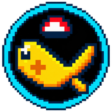

<div align="center">

  

  # 🎣 FISH CLICKER
  
  **Um jogo clicker retrô de pescaria em pixel art pura, rico em espécies, aquário com buffs, customização e suporte mobile offline.**

  [](https://stayflinstons.github.io/fish-clicker/)
  [](https://stayflinstons.github.io/fish-clicker/)
  [](https://stayflinstons.github.io/fish-clicker/)
  [](https://stayflinstons.github.io/fish-clicker/)
  [](LICENSE)

  <br />

  ### 🌐 [▶ JOGAR AGORA NO NAVEGADOR](https://stayflinstons.github.io/fish-clicker/)
  *(Funciona no Computador, Android e iPhone com suporte a instalação em tela cheia)*

</div>

---

## 📖 Sobre o Jogo

**Fish Clicker** é um jogo incremental (*clicker / idle*) imersivo onde você assume o papel de um pescador iniciante que busca os maiores tesouros e peixes míticos das águas doces e abissais.

Conforme você pesca, acumula ouro, aprimora suas varas de pescar e iscas, desbloqueia peixes raros e expande seu aquário para receber multiplicadores permanentes de ouro. No ápice da sua jornada, você ativará o misterioso **Portal Dimensional**, encerrando o lendário **Capítulo 1** e preparando o terreno para mundos inexplorados!

---

## ✨ Funcionalidades Principais

### 🎣 1. Mecânica de Pesca & Linha Dinâmica
- **Pesca Manual:** Arremesse e fisgue peixes clicando no lago.
- **Linha de Pesca Conectada:** Linha animada milimetricamente conectada na ponta da sua vara de pesca até a água.
- **Pescador Automático:** Contrate ajudantes que pescam de forma passiva enquanto você gerencia seus recursos.
- **Peixe Dourado (Golden Fish):** Evento surpresa estilo *golden cookie* que surge nadando pelo lago concedendo bônus temporários e montantes enormes de ouro instantâneo.
- **Ímã Dourado:** Upgrade passivo que captura automaticamente o Peixe Dourado.

### 🐟 2. Ecossistema Rico de Peixes (21+ Espécies)
- Peixes divididos em 5 categorias de raridade:
  - ⚪ **Comum:** Lambari, Tilápia, Carpa, Bagre...
  - 🟢 **Incomum:** Truta Arco-Íris, Robalo, Dourado, Tucunaré...
  - 🔵 **Raro:** Pirarucu, Aruanã Prata, Salmão Real...
  - 🟣 **Épico:** Jaú Gigante, Piraíba Fantasma, Peixe Elétrico Ancestral...
  - 🟡 **Lendário & Primordial:** Leviatã das Profundezas, Serpente Solar Primordial...
- Cada peixe possui sprite pixel art único, peso aleatório, valor de mercado e bônus de aquário.

### 🐠 3. Aquário Vivo & Sistema de Buffs
- Guarde espécimes raros e lendários no seu aquário particular.
- Peixes no aquário concedem **multiplicadores passivos de ouro (+5%, +15%, +35%...)** para cada peixe pescado.
- Filtro inteligente do aquário para organizar por raridade, nome e buffs.
- Peixaria automática com filtros configuráveis de venda por raridade.

### 👤 4. Customização Completa do Pescador
- **Nome Customizado:** Escolha seu nome de pescador, exibido no topo e na plaquinha de madeira do píer.
- **Modelos:** Opções de boneco masculino e feminino em pixel art.
- **Guarda-Roupa Retrô:** Trajes nas cores Verde Clássico, Azul Marinho, Rubi, Dourado, Abissal e Coral.
- **Cores de Cabelo:** Ruivo, Moreno, Loiro, Preto e Rosa.

### 🏆 5. Sala de Troféus (22 Conquistas)
- Sistema completo de conquistas com notificações em tempo real.
- Desafios cobrindo compras de varas, iscas, níveis de upgrades, capturas do peixe dourado e enciclopédia completa.

### 📖 6. Álbum / Enciclopédia de Pesca
- Registre cada espécie descoberta com data e recorde de maior peso pescado.
- Silhuetas misteriosas para espécies que você ainda não encontrou.

### 🌌 7. O Portal Dimensional (Fim do Capítulo 1)
- Desbloqueie a lendária **Vara da Travessia Astral** e a **Essência do Vórtice Dimensional** para sincronizar o Portal `(2/2)`.
- Modal comemorativo selando a vitória da V1 e preparando o terreno para o **Mundo 2**!

---

## 📱 Suporte Mobile & PWA (Offline)

O jogo foi desenvolvido com arquitetura **Progressive Web App (PWA)** nativa:
- 📲 **Instalável em 1 Toque:** Adicione direto à tela inicial no Android e iPhone.
- 📺 **Modo Tela Cheia (Standalone):** Oculta a barra de endereço do navegador, proporcionando sensação 100% de aplicativo nativo.
- ⚡ **100% Offline:** Service Worker com cache inteligente — pesque em viagens, no modo avião ou sem internet!

---

## 🎮 Como Rodar Localmente

Se quiser clonar e rodar em seu próprio computador:

```bash
# 1. Clone o repositório
git clone https://github.com/StayFlinstons/fish-clicker.git

# 2. Acesse a pasta do projeto
cd fish-clicker

# 3. Inicie um servidor local (Python, Node ou qualquer servidor HTTP)
python -m http.server 3000
# ou
npx serve .
```

Abra no navegador: `http://localhost:3000`

---

## 🛠️ Tecnologias Utilizadas

- **HTML5 & CSS3** (Flexbox, Grid e animações fluidas)
- **JavaScript Moderno (ES6+ Modules)** (Sem frameworks pesados, foco em performance pura)
- **HTML5 Canvas API** (Renderização pixel art procedural da água, peixes, partículas e do pescador)
- **Web Audio API** (Efeitos sonoros gerados por sintetizador, sem dependência de arquivos de áudio externos)
- **Tailwind CSS** (Interface limpa, moderna e responsiva para qualquer dispositivo)
- **Service Worker & Web App Manifest** (Suporte PWA e funcionamento offline)

---

## 🗺️ Roadmap (Capítulo 2)

- [ ] Novo bioma: Arquipélago Abissal & Vulcão Submarino
- [ ] Barcos e expedições em alto mar
- [ ] Sistema de Iscas Artesanais e Culinária de Peixes
- [ ] Chefões Marinhos com minigame de puxada de linha
- [ ] Tradução multilíngue (EN / PT-BR / ES)

---

<div align="center">
  Desenvolvido com carinho e paixão por jogos retrô 🎣✨<br>
  <b>Fish Clicker</b> — Por <a href="https://github.com/StayFlinstons">StayFlinstons</a>
</div>
